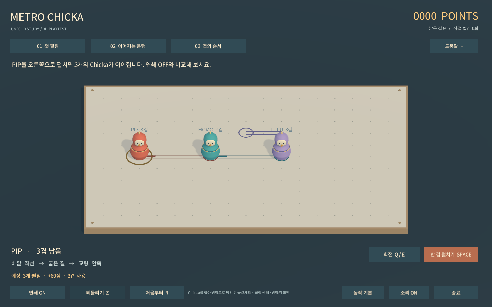
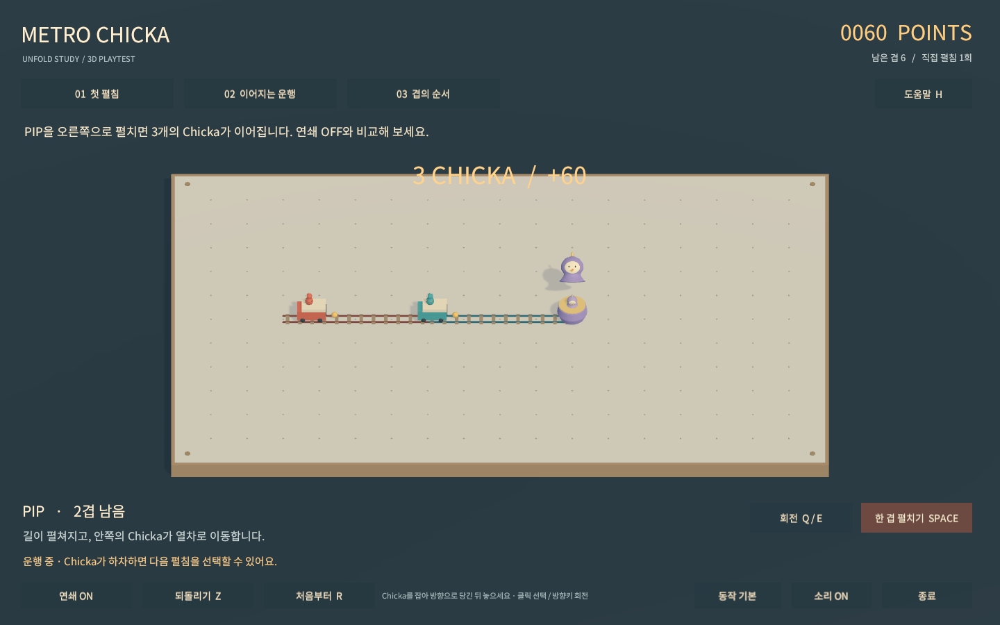
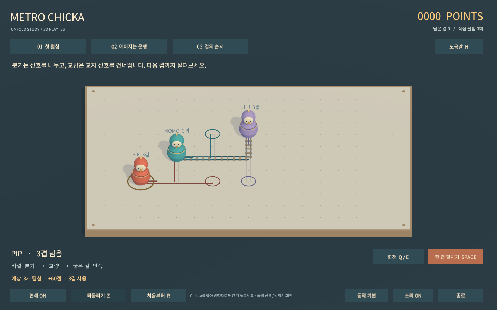

# Unfold Study A01 검증 기록

검증일: 2026-09-09. Unity 6000.3.23f1 / macOS Apple Silicon.

## 확인 결과

| 검증 | 결과 |
| --- | --- |
| EditMode | 22개 통과. 겹 소비, 내부 순서, 예측 무변경, 경계, 교량 절연, 분기, 기존 길 전달, 순환 차단, 스냅샷 독립성 |
| PlayMode | 3개 통과. 실제 씬과 버튼에서 열차 등장·소멸 및 하차, 연쇄·되돌리기, 운행 중 중복 입력 차단 |
| macOS 빌드 | 성공 |
| Windows x64 Mono 빌드 | 성공. EXE가 PE32+ x86-64이며 Data·DLL·Mono 런타임 함께 패키징 |
| 그래픽을 사용하는 macOS 배치 플레이어 | 성공. 3D Physics 레이캐스트 드래그, UI 레이캐스트, 3개 장면, 신호 ON/OFF, 하차·열차 소멸, 되돌리기, 동작 줄이기, 경계 거부 |
| 게임 카메라 캡처 | 1440×900, 1600×900 렌더 및 육안 점검 |
| 일반 macOS 창의 수동 조작 | 미검증. 실행을 시도했으나 현재 호스트 세션에서 프레임이 진행되지 않아 중단 |
| Windows 실제 실행 | 미검증. 현재 호스트는 macOS |
| 재미·독창성·5~10달러 구매 의향 | 미검증. 실제 사용자 플레이테스트 필요 |

배치 플레이어는 실제 게임의 카메라와 입력 처리 함수를 사용한다. UI 클릭은 EventSystem의 레이캐스트와 클릭 이벤트로, 3D 드래그는 일반 실행과 동일한 포인터 처리 경로로 검증했다. 물리 마우스를 이용한 수동 사용성 테스트와는 구분한다.

## 확인된 A/B 차이

장면 02에서 초기 PIP을 오른쪽으로 펼칠 때:

- **연쇄 ON:** PIP, MOMO, LULU가 각각 한 겹 사용. 총 3겹 소비, 60점. 총 남은 겹 9 → 6.
- **연쇄 OFF:** PIP만 한 겹 사용. 10점. 총 남은 겹 9 → 8.
- 되돌리기는 위치, 사용한 겹, 점수, 생성된 길과 당시 연쇄 설정을 함께 복원한다.

이는 기능 차이에 대한 관찰이다. ON이 더 재미있다는 결론은 아니다.

## 설계상 남은 판단

- 지금은 연쇄 전체를 예측하고 약간의 간격으로 펼침을 연출한다. 실제 신호 도착 시점이나 열차 충돌이 판정에 영향을 주지 않는다. 타이밍 게임처럼 표현하지 않는다.
- 한 번의 펼침 연출에는 기본 설정에서 약 2초가 걸린다. 이 시간이 기대감인지 대기인지 플레이테스트로 확인한다. 동작 줄이기로 짧은 버전과 비교할 수 있다.
- 현재는 내부 순서가 다른 3개 연습 장면이다. 서로 다른 장기 전략이 존재한다는 증거나 유료 판매 분량이 아니다.
- 미리보기는 예상 길과 하차 위치를 표시한다. 신호의 전달 순서 표현과 겹 보유량의 입체적 표현은 더 개선할 수 있다.
- 음향과 모델은 절차적으로 생성한 임시 에셋이다. 외피가 길로 전환되는 연출은 초기 형태이며 최종 아트가 아니다.
- 세션 저장·장기 성장·완주 캠페인·무한 모드·코드 서명과 공증은 구현하지 않았다.

## 실제 플레이어 이미지

후속 방향은 [PLAYTEST.md](PLAYTEST.md)의 비교 항목으로 실제 플레이 피드백을 받은 뒤 정한다.
